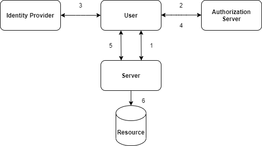
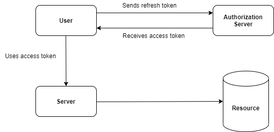
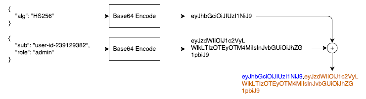

## JSON Web Tokens (JWT)
- JWT (pronounced "jot") a standard for safely passing "claims" in space constrained environments.
- A JSON web tokens looks like:

```js
eyJhbGciOiJIUzI1NiIsInR5cCI6IkpXVCJ9.
eyJzdWIiOiIxMjM0NTY3ODkwIiwibmFtZSI6IkpvaG4gRG9lIiwiYWRtaW4iOnRydWV9.
TJVA95OrM7E2cBab30RMHrHDcEfxjoYZgeFONFh7HgQ
```
Above is a compact and printable representation of a series of "claims" along with a signature to verify its authenticity.
```js
{
"alg": "HS256",
"typ": "JWT"
}
{
"sub": "1234567890",
"name": "John Doe",
"admin": true
}
```
Claims?
Definitions or assertions made about a certain party or object.Some are part of the JWT spec, others are user defined.
- JWTs can also be signed using JWS ('S' for signature) or encrypting them, JWE (Encryption)
- JWS, JWE with JWTs provide powerful and secure solution to many problems.

## Problems that JWT solve
**Main Purpose**: Transfer claims between two parties.
Some of the practical applications include:
- Authentication
- Federated Identity
- Authorization
- Client-Side session ("Stateless" sessions)
- Client side secrets.

## History
**JOSE** : JSON object signing and Encryption Group formed in 2011.
**Objective**: "Standardize the mechanism for integrity protection(signature and MAC) and encryption as well as the format for key and algorithm identifiers to support interoperability of security services for protocols that use JSON"
In 2013 series of drafts, cookbook with examples available.Later these drafts would become JWT,JWS,JWE,JWK and JWA RFCs.

## PRACTICAL APPLICATIONS
### 1. Client-Side/Stateless Sessions
**Stateless Sessions**: nothing but client-side data
-JWTs, by the virtue of JWS and JWE can provide various types of signature and encryption.
- Singatures are useful to validate data against tampering.
- Encryption is useful to protect data from being read by third parties.
- Security considerations in Client-Side sessions:
	- Signature Stripping 
	- Cross-Site Request Forgery (CSRF)
	- Cross-Site Scripting (XSS)
- Are Client Side sessions useful?
	- Both pros and cons. A certain balance between client-side data and database lookups in the backend is necessary. It depends upon the data-model of the application.

*See the example for shopping application in JWT-Handbook*
### 2. Federated Identity
- Federated Identity systems allow different, possibly unrelated parties to share authentication and authorization services with other parties.
- User's identity is centralized.
- JWTs can be used for this purpose.
- Essential Flow of the authorization process is:



Steps:
1. User attempts Resource Access by a server.
2. Doesn't have proper credentials, redirected to Autorization Server which is configured to let users lign using credentials managed by an Identity Provider.
3. Gets redirected from Authorization Server to Identity Provider login screen
4. Logs-in, gets redirected to Authorization Server which now uses this credential to access resource server.
5. Gets redirected to resource server from Authorization Server having correct credentials to access the resource.
6. User gets access to the resource.

Credentials returned from Authorization Server to the User can be encoded with JWT.
#### Access and Refresh Tokens
##### Access Tokens
- Tokens that give those who have them access to protected resources.
- Usually short lived, may have expiration date embedded with them.
- May carry extra info like IP addr from which requests are allowed.

##### Refresh Tokens
Allow clients to request new access tokens. It is required when the access token has expired and client wants a new access token from the server.
These are usually long lived.


Signed JWTs make good access tokens as:
- They encode all the neccessary data to differentiate access levels to a resource.
- Can carry expiration date.
- Are signed to avoid validation queries against the authorization server.

JWTs may also be used as refresh tokens. But there is less reason for this purpose as - 
- Most of the time a simple UUID will suffice as no need for token to carry a payload.

See the example for this section in the JWT handbook.

## JSON Web Tokens in Detail
All JWTs are constructed from three different elements:
- The Header
- The Payload
- The Signature / encryption data (depending upon the algo used for signing or encryption, ommitted in case of unencrypted JWTs)

JWTs can be encoded in a compact representation known as **JWS/JWE Compact Serialization**.
It is Base64 URL-safe encoding of UTF-8 bytes of the first two JSON elements (header + payload) and the data required for signing or encryption which is also Base64-URL encoded.
All three are separated by '.'
```
NOTE: JWT uses a variant of Base64 encoding ie safe for URLs basically sustituting '+' and '/' for '-' and '_'.
Padding also removed. Also reffered to as "base64url".
```
Resulting sequence is a printable string:
```js
eyJhbGciOiJIUzI1NiIsInR5cCI6IkpXVCJ9.
eyJzdWIiOiIxMjM0NTY3ODkwIiwibmFtZSI6IkpvaG4gRG9lIiwiYWRtaW4iOnRydWV9.
TJVA95OrM7E2cBab30RMHrHDcEfxjoYZgeFONFh7HgQ
```
The decoded header is:
```js
{
"alg": "HS256",
"typ": "JWT"
}
```
and the decoded payload :
```js
{
"sub": "1234567890",
"name": "John Doe",
"admin": true
}
```
and the secret required for verifying the signature is "secret".

#### The Header
Every JWT carries a header also called JOSE header, which claims about itself.
It establishes the algorithms used, whether the JWT is signed or encrypted and how to parse the JWT.

Depending upon type of JWT more fields may be mandatory.
Only mandatory claim for unencrypted JWT header is the "alg" claim.
- `alg`: main algorithm in use for signing and/or decrypting the JWT.

For unencrypted, JWT this must be set to "none".
Optional headers claims are `typ` and `cty` claims.
- `typ`: media type of JWT itself. Should be set to JWT.
- `cty`: content type.Must not be set for specific claims plus arbitrary data as part of payload.Must be set to "JWT" for if payload is a nested JWT itself.

For unencrypted JWT it is usually,
```js
{
	"alg": "none"
}
```

#### The Payload
All interesting user data is added here. It is a JSON object like header.
```js
{
	"sub": "1234567890",
	"name": "John Doe",
	"admin": true
}
```
##### Registered Claims:
-**iss**: (from issuer): case-sensitive str or URI uniquely identifying the JWT issuer party.
-**sub**: (from subject): case-sensitive str or URI uniquely identifying the party about whom information is in the JWT.Must be unique in context of the issuer.
- **aud**: (from audience): case sensitive str, URI or array of such values uniquely identifying the recipients of this JWT.
- **exp**:(from expiration time): Specific date and time in format "seconds since epoch" as definition in POSIX. Sets the exact moment from which the JWT is considered invalid.
- **nbf**:(not before time): Opposite of expiration claim. Exact moment from which the JWT is considered valid.
- **iat**:(issued at): specific date and time at which this JWT was issued.
- **jti**:(from JWT ID): string representation unique identifier for this JWT.

### Public and Private Claims:
All claims other than registered claims are either private or public claims.
- **Private Claims**: Defined by users of the JWTs.
- **Public Claims**: Either registered with the IANA JSON Web Token Claims registry or named using a collision resistant name.
In both cases, care must be taken to prevent collisions.

## Unsecured JWTs
These are the simplest JWTs, formed by a simple(usually static) header.
```js
{
	"alg": "none"
}
```
and a user defined payload. eg:
```js
{
	"sub": "user123",
	"session": "ch72gsb320000udocl363eofy",
	"name": "Pretty Name",
	"last page": "/views/settings"
}
```
As there is no signature or encryption, this JWT is encoded as simply two elements.
```js
eyJhbGciOiJub25lIn0.
eyJzdWIiOiJ1c2VyMTIzIiwic2Vzc2lvbiI6ImNoNzJnc2IzMjAwMDB1ZG9jbDM2M
2VvZnkiLCJuYW1lIjoiUHJldHR5IE5hbWUiLCJsYXN0cGFnZSI6Ii92aWV3cy9zZXR0aW5ncyJ9
```
- May be fit for client-side use.
- Even if signature is not there, last dot is present.
- In practice, unsecured JWTs are rare.

### Creating an unsecured JWT
From JSON version of header and payload to unsecured JWTs in following steps:
1. Take the header as a byte array of its UTF-8 representation.No need to minify or strip the JSON.
2. Encode the byte array using the Base64-URL algorithm, removing trailing equal signs(=)
3. Take the payload as a byte array of its UTF-8 representation.No need to minify or strip the JSON before encoding.
4. Encode the byte array using the Base64-URL algorithm, removing trailing equal signs(=).
5. Concatenate the resulting string, putting first the header followed by a '.' character, followed by the payload.

Validation of both header and payload (wrt to presence of required claims and the correct use of each claims) must be performed before encoding.
*Add flowchart here*

*See the example in this section in the handbook.*
### Parsing an Unsecured JWT
From compact serialization form to JSON representation in the following steps:
1. Find the first period '.' character.Take the string before it.
2. Decode the string using the Base64-URL algorithm.Result is the JWT header.
3. Take the string after the period from step 1.
4. Decode the string using the Base64-URL algorithm.Result is the JWT payload.

Resulting JSON can be pretified if neccessary.
*See the example for this section in the handbook.*
## JSON Web Singatures

