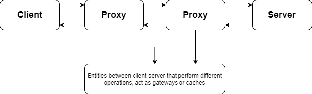

HTTP is a protocol that allows the fetching of resources, eg: HTML Documents.
- It is the foundation of any data exchange on the Web.
- Follows the Client-Server Protocol (requests initiated by usually web browsers).
- Complete document reconstructed from sub-docuements fetched.
- Client server communication by exchange of indivudual messages. (In the form of "REQUESTS" from the client and "RESPONSES" from server).
- It is an Application Layer protocol sent over TCP or TLS-Encrypted TCP connection.
- Due to its extensibility, also used to fetch images, videos or post content to the server.
- Can also be used to fetch part of documents to update Web pages on Demand.

## Components of HTTP-based Systems

**NOTE**: There are more computers between browser and server like routers, modems and more.
But are hidden in network and transport layers. HTTP is on top at the application layer.
These underlying layers are mostly irrelevant to HTTP.

### Client - The User Agent
Any tool acting on the behalf of the user. (mostly web-browser)
### The Web Server
- Servers that serves the document requested by the client.
- Virtually appears only as a single machine. But actually may be a collection of servers, sharing the load or a complex piece of software interrogating other computers like cache, server.
- Not necessarily a single machine, but several server instance can be hosted on the same machine.

### Proxies
