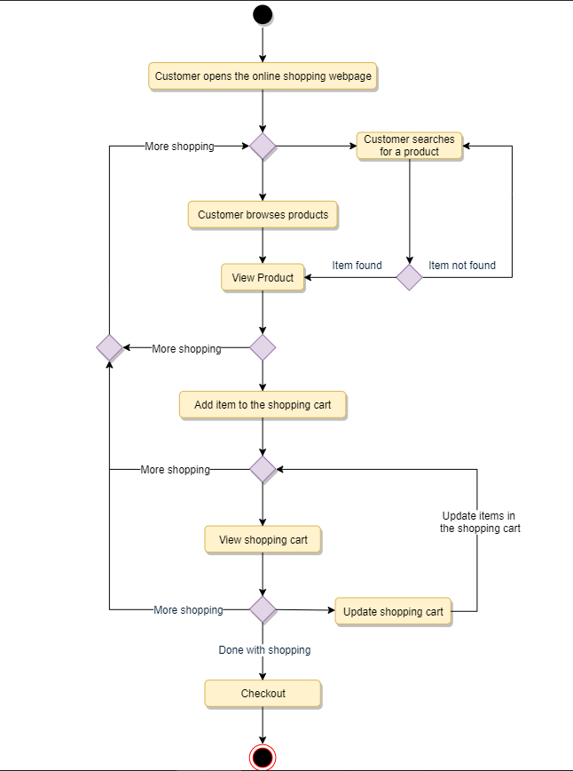

# Object-Oriented Design and UML
The process of OO analysis and design can be described as:
1. Identifying the objects in a system.
2. Defining relationships between objects.
3. Establishing the interface of each object, and 
4. Making a design that can be converted to executables using OO languages.

Method/tool used to document all these information is UML(Unified Modelling Language). It can be considered as the successor of OO Analysis and Design.  

## What is UML?
UML stands for Unified Modelling Language which is used to model the Object-Oriented Analysis of a software system. It is a way of visualising and documenting a software system using a collection of diagrams.
### Benefits of UML
- Develops a quick understanding of a software system.
- UML modelling helps breaking down a complex system into discrete pieces that can be easily understood.
- UML's graphical notations can be used to communicate design decisions.
- Easier to abstract out concepts as it is platform and langauge independent.
- Becomes easier to hand over the system to a new team.

### Types of UML Diagrams
- 14 different types of diagrams, organized into two distinct groups - structural diagrams and  behavourial or interaction diagrams.
- **Structural Diagrams**
	- Class Diagram
	- Object Diagram
	- Package Diagram 
	- Component Diagram
	- Composite Structure Diagram
	- Deployment Diagram
	- Profile Diagram
- Behavioral UML Diagrams
	- Use case diagram
	- Activity Diagram
	- Sequence Diagram
	- State Diagram
	- Communication Diagram
	- Interaction Overview Diagram
	- Timing Diagram

We will focus on following UML Diagrams:
- **Use case Diagram**: Used to describe a set of user scenarios, this diagram illustrates the funtionality provided by the system.
- **Class Diagram**: Used to describe structure and behavior in the use cases, this diagram provides a conceptual model of the system in terms of entities and their relationships.
- **Activity Diagram**: Used to model the functional flow-of-control betwen two or more class objects.
- **Sequence Diagram**: Used to describe interation among classes in terms of an exchange of messages over time.

#### Use case Diagrams
Use case diagrams describe a set of actions(use cases) that a system should or can perform in collaboration with one or more external users of the system(actors). Each use case should provide some observable and valuable result to the actors.

A use case illustrates a unit of functionality provided by the system.

To illustrate a use case in a use case diagram an oval is drawn with the use case written inside it. To show an actor in a use-case diagram stick figures are drawn to the left or right of the diagram.

Different components of the use-case diagram:
- **System Boundary**: It defines the scope and limit of the system, shown as a rectangle that spans all the use cases of the system.
- **Actors**: An actor is an entity who performs specific actions. For eg: in a banking system, customer is one of the actors.
- **Use case**: Every business functionalilty is a potential use case.
- **Include**: Include relationship represents invocation of one use case by another use case.From coding perspective, its like one function being called by another.
- **Extend**: This relationship signifies that the extended use case will work exactly like the base use case, except some new steps will be inserted in the extended use case.

#### Class Diagrams
- Backbone of Object-oriented modelling.
- Describes the attributes and operations of a class and the constrained imposed on the system.
- They are widely used and are the only UML diagrams that can be mapped directly to OO languages.
- Purpose:
	- Analysis and design of the static view of an application.
	- To describe the responsibilities of a system.
	- Provides a base for component and deployment diagrams.
	- Forward and reverse engineering..

Different types of relationship between classes:
- **Association**: Link between two classes needed to communicate with each other is represented by an association by a line between these classes that can be uni-directional or bi-directional depending upon the relationship.
- **Multiplicity**:Indicates how many instances of a classs particpate in the relationship.
- **Aggregation**: Special type of association used to model a "whole to its parts" relationship. In a basic aggregation relationship, the lifecycle of a PART class is independent of the WHOLE class' lifecycle. Simply, an aggregation implies a relationship where the child can exist independently of the parent.
- **Composition**: Another form of the aggregation relationship. It implies a relationship where the child cannot exist independent of the parent. 
- **Generalization**: Mechanism of combining simillar class of objects into a single, more general class. 
- **Dependency**: It is a relationship in which one class, the client uses or depends on another class, the supplier.
- **Abstract class**: Identified by specifying its name in italics.

Example class diagram:

UML conventions

#### Sequence Diagrams
Sequence diagrams describe the interactions among classes in terms of exchange of messages over time and are used to explore the logic of complex operations, function or procedures.
The sequence of operations are represented in a step-by-step manner.
They can be drawn for a particular use case or even just part of a use case

Two dimensions of a sequence diagram:
- **Vertical Dimension**: Shows sequence of messages in the chronological order that they occur.
- **Horizontal Dimension**: Shows the object instances to which the messages are sent.

#### Activity Diagrams
They are used to illustrate the flow of control in a system. They can also be used to refer to the steps involved in the execution of a use case.
Typically they are used to model workflow or businesss process and internal operations.
An example activity diagram for user performing online shopping:

Difference between Activity Diagram and Sequence Diagram:
- **Activity Diagram** captures the process flow and is used for functional modelling. A functional model represents the flow of values from external inputs, through operations and internal data stores, to external outputs.
- **Sequence diagram** tracks the interaction between the objects. It is used for dynamic modelling, represented by tracking states, transition between states and the events that trigger these transitions.
